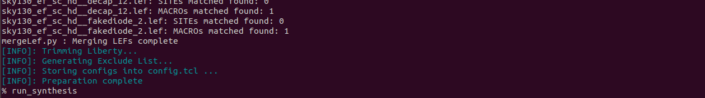

# RTL-to-GDSII Flow for High-Speed USB 2.0 Device

## Introduction
This document outlines the complete RTL-to-GDSII flow implemented for a **High-Speed USB 2.0 device**. The project demonstrates how open-source tools, primarily **OpenLANE**, can be used to implement a structured ASIC design flow, covering all stages from RTL design to the final GDSII layout.

## Objectives
- To implement the ASIC design flow for a `High-Speed USB 2.0 device` while adhering to USB 2.0 specifications.
- To demonstrate each step of the flow, including **synthesis**, **floorplanning**, **placement**, **routing**, and **signoff**.
- To showcase the integration of open-source tools like **OpenLANE**, **Yosys**, **Magic**, and **KLayout** into a comprehensive design pipeline.

## OpenLane Project Directory Structure

The **OpenLane** project directory is organized to facilitate the complete ASIC design flow. Below is a typical directory structure with a brief explanation of each component:
```
Openlane/
├── Designs/
│   ├── usb/
│   |   ├── config.tcl
│   |   ├── sky130A_sky130_fd_sc_hs_config.tcl
│   |   ├── sky130A_sky130_fd_sc_ls_config.tcl
│   |   ├── sky130A_sky130_fd_sc_ms_config.tcl
│   |   ├── sky130A_sky130_fd_sc_hd_config.tcl
│   |   ├── sky130A_sky130_fd_sc_hdll_config.tcl
│   |   ├── src/
│   |   |   ├── usb_2p0_core.v
├── configuration/
│   ├── checkers.tcl
│   ├── cts.tcl
│   ├── floorplan.tcl
│   ├── general.tcl
│   ├── lvs.tcl
│   ├── placement.tcl
│   ├── routing.tcl
│   ├── synthesis.tcl
│   ├── README.md
├── flow.tcl         
├── clean_runs.tcl
```

To start the OpenLANE flow, first open the terminal, and get into the openlane directory as shown below:


To start the OpenLANE flow, type `docker` inside the openlane directory. You can check your current directory which is shown as `**OpenLANE_flow**`

In OpenLane, designs can be run in two primary modes:

**1. Interactive Mode**
- This mode allows users to execute each stage of the design flow step by step, providing flexibility and control over the process.
- Useful for debugging and understanding the design flow.

**2. Autonomous Mode:**
- This mode runs the entire design flow from RTL to GDSII in a single command.
- Suitable for quick execution or batch processing of designs.

RTL to GDS Flow of USB 2.0 is going to be run in an interactive mode in which we are able to notice the changes happenning to the design interactively.
To run the openlane in interactive mode, run the command `./flow.tcl -interactive` as shown below:


You can see the OpenLANE prompt has started. Now intialize the required package(0.9) required for openlane as follows and run the command `prep -design usb` to intitialize the design for which you want continue the interactive mode of process.


You can see after this, all LEF files getting merged and showing all related information related to design as above.
Our design has to  proceed with `6 layers` as per availability shown above.
In addition to this, inside `usb` directory, we can see another sub directory is created wiith name `runs`. This folder contains all stats of the design including `results` and `reports`. 
The directroy structure of `runs` is as follows:

```
usb/
├── runs/
│   ├── 25-01_11-17/
│   |   ├── cmds.log
│   |   ├── config.tcl
│   |   ├── logs
│   |   |   ├── o-prep_runtime.txt
│   |   |   ├── cts/
│   |   |   ├── cvc/
│   |   |   ├── floorplan/
│   |   |   ├── flow_summary.log
│   |   |   ├── klayout/
│   |   |   ├── lvs/
│   |   |   ├── magic/
│   |   |   ├── placement/
│   |   |   ├── routing/
│   |   |   ├── synthesis/
│   |   ├── OPENLANE_VERSION
│   |   ├── PDK_SOURCES
│   |   ├── reports/
│   |   |   ├── cts/
│   |   |   ├── cvc/
│   |   |   ├── floorplan/
│   |   |   ├── klayout/
│   |   |   ├── lvs/
│   |   |   ├── magic/
│   |   |   ├── placement/
│   |   |   ├── routing/
│   |   |   ├── synthesis/
│   |   ├── results/
│   |   |   ├── cts/
│   |   |   ├── cvc/
│   |   |   ├── floorplan/
│   |   |   ├── klayout/
│   |   |   ├── lvs/
│   |   |   ├── magic/
│   |   |   ├── placement/
│   |   |   ├── routing/
│   |   |   ├── synthesis/
│   |   ├── tmp/
```

Inside `runs`, a sub-directory with name current date and time is created in which we will have log files, reports and results of the respective process during RTL to GDS Flow.
 ## Synthesis
As a first step of deisgn flow, run the command `run_synthesis` in the openlane prompt as shown below:




When the `run_synthesis` command is executed in OpenLane, the following processes take place, performed by the respective tools:
```
- RTL Synthesis
    - Tool: yosys
        - Yosys converts the high-level RTL (Verilog) design into a gate-level netlist by performing logic synthesis. It optimizes the design based on the constraints and the standard cell library provided.

- Technology Mapping
    - Tool: abc
        - ABC maps the logic to the specific gates available in the target standard cell library, ensuring that the synthesized design adheres to the technology's requirements.

- Static Timing Analysis (STA)
    - Tool: OpenSTA
        - OpenSTA performs timing analysis on the synthesized netlist to ensure it meets timing constraints. It generates reports detailing the timing paths, slack, and potential violations.
        - These steps collectively result in a gate-level netlist (.vg file) optimized for the specified PDK and constraints.
```
After Synthesis was successful, you can see the synthsis file `usb.synthesis.v` has been created inside the `results` directory as shown below


You can open the file and able to view the content as shown below:


To view the netlist, run the command `yosys` to start the yosys prompt, and inside the yosys prompt run the commands `read_verilog usb.synthesis.v` and `show usb`.
You can see a netlist view as follows:


By default, the netlist is in `dot` format. To convert it into `pdf` format, run the command `show -format pdf -prefix netlist_usb` inside the yosys prompt. You will find the pdf format of the netlist has been created.


Now, explore the files inside the `reports` directory, there you will find the reports of `Timing analysis and Synthesis`


After viewing the reports, we found that the `tns - Total negative slack` is `-0.13`, which is a timing violation, and we will not achive the required performance of the design.

So to tackle this issue, let's explore the different `synthesis strategies` of  `Yosys`.
Note that, the Synthesis Strategy of Yosys is stored in the env variable `SYNTH STRATEGY`
To know the current `SYNTH_STRATEGY`, run the command `echo $::env(SYNTH_STRATEGY)` as shown below.


We can see the current SYNTH_STRATEGY is set to be as `AREA 0`. To address timing issues, set the `SYNTH_STRETEGY` to `DELAY 2` as shown below...


Now rerun the synthesis using the command `run_synthesis`


Now we achieved the timing with `tns` and `wns` equal to `0.00`. This is one of the way to tackle timing violations...

Now we can view our Synthsis reports and netlist using `YOSYS`


Here we can notice one thing, that in the reports when the design inntroduced timing vioation, the chip area is found to be `10054.643200`. After we fix up timing violation by changing the `SYNTH_STRATEGY` to `DELAY 2` , there is an increase in chip area i.e., `11089.385600`. From this we can conclude that, area and timing are trade off to each other. To acheive correct timing behaviour, we have to sacrifice area.


## Floorplanning

To run floorplanning in openlane, the command is `run_floorplan`. 
When the `run_floorplan` command is executed in OpenLane, the following processes take place, performed by the respective tools:
```
- Define Core Area and Placement Rows
     - Tool: init_fp
            - This tool defines the core area where the design will be placed. It also sets up the rows that will be used for standard cell placement.

- Place IO Ports
     - Tool: ioplacer
            - The ioplacer tool is responsible for placing the input and output ports of the macros. It positions these ports efficiently within the design to minimize congestion and facilitate routing.

- Generate Power Distribution Network (PDN)
     - Tool: pdn
            - The pdn tool generates the power distribution network. It places power and ground pads and defines the routing resources for power delivery across the chip.

- Insert Tap Cells and Decap Cells
     - Tool: tapcell
            - The tapcell tool inserts welltap cells (to prevent latch-up) and decap cells (for noise filtering) into the floorplan, ensuring proper power grid integrity.

```

Run the command `run_floorplan` as shown below:


you can view the corresponding results and reports in the runs `directory`. The klayout view after `floorplanning` is as follows:


To view the layout in `magic`, run the command shown below. To view you will require the `sky130A.tech` file, which is a part of `Sky130A PDKs`.


The view of layout after floorplanning in magic is as follows:


Now, you can view the Floorplanning related reports in the `reports` directory

## Placement

The next step of VLSI Design Flow is Placement. To execute placement in openlane, te command is `run_placement`.
When the `run_placement` command is executed in OpenLane, the following processes take place, performed by the respective tools:

```
Global Placement

Tool: RePLace
RePLace performs the global placement of cells in the design. It arranges the cells in an initial position based on the timing, area, and congestion constraints, while attempting to minimize wirelength and improve the design’s overall performance.
Placement Optimization

Tool: Resizer
Resizer performs optional optimization on the global placement. It adjusts the positions of the cells to improve the design's area, timing, and overall efficiency. This step aims to balance the design's layout, reducing congestion and wirelength.
Timing Optimization

Tool: OpenPhySyn
OpenPhySyn is responsible for timing optimization during the placement phase. It adjusts the cell placement to ensure that timing constraints (such as setup and hold time) are met. It also reduces the slack to improve overall performance.
Detailed Placement and Legalization

Tool: OpenDP
OpenDP performs detailed placement, ensuring that all components are legalized according to design rules. This step checks and adjusts the placement to meet manufacturing requirements, such as cell spacing and alignment. It ensures that no violations occur in the physical design.

```

After the placement step has executed, you can see as follows:


The klayout view of the layout after placement is as follows:


To view the layout in magic, run the following command.


To view the physical layers inside magic click on `X`. Then you can view the layout as follows:


Now, you can view the Placement related reports as shown below:


## CTS

The next step after Placement is Clock tree synthesis. It defines the clock network for the clock signal from source to the clock pins of the FFs.
The command to execute `Clock Tree Synthesis` is `run_cts`
When the `run_cts` command is executed in OpenLane, the following processes take place, performed by the respective tools:

```
- Clock Tree Synthesis
      - Tool: TritonCTS
            - TritonCTS is the tool responsible for synthesizing the clock distribution network (the clock tree). It builds a clock tree that distributes the clock signal from the source (usually the clock pin) to all the flip-flops and clocked elements in the design. The goal is to minimize clock skew and ensure balanced delivery of the clock signal, which is crucial for meeting the timing requirements.

- Buffer Insertion
      - Tool: TritonCTS
            - During clock tree synthesis, TritonCTS inserts buffers into the clock tree to ensure the clock signal can drive the entire design without degradation. These buffers help maintain the strength of the clock signal across the chip.

- Skew Minimization and Optimization
      - Tool: TritonCTS
            - TritonCTS also optimizes the clock tree to reduce skew, which is the variation in arrival times of the clock signal at different registers. Minimizing clock skew is crucial for ensuring that all registers receive the clock signal at the same time, meeting the timing constraints.

- Clock Tree Balancing
      - Tool: TritonCTS
            - The tool ensures that the clock tree is balanced, meaning that the delay from the clock source to each flip-flop is as equal as possible. This step helps improve performance and ensures that the timing is met across the entire design.

- Timing Optimization
      - Tool: TritonCTS
            - During the clock tree synthesis, TritonCTS also optimizes the clock tree to reduce delay variations, ensuring all flip-flops receive the clock signal with minimal skew.

- Static Timing Analysis (STA)
      - Tool: OpenSTA
            - During the run_cts command, STA is performed using OpenSTA. This step checks the timing of the entire design, including the newly synthesized clock tree. It verifies that the timing constraints (setup time, hold time, and clock skew) are satisfied after the clock tree is created. It identifies any timing violations and helps ensure that the design meets the required performance.
```

After the command has executed, we can view the layout in both klayout and magic
Below is the klayout view of the CTS executed layout.


To view the layout in magic, follow the similar steps as before. 


Now you can view the `Timing` and `CTS` reports as follows:

#####################

## Routing

The next step is `Routing`. It's one of the most critical step in the VLSI Physical Design which includes two major steps i.e., `Global Routing` and `Detailed Routing`. 
The command to execute routing is `run_routing`
When the `run_routing` command is executed in OpenLane, the following processes take place, performed by the respective tools:

```
- Global Routing
     - Tool: FastRoute or CU-GR (Alternative)
          - FastRoute performs global routing by determining the general paths that wires should take across the design. It generates a guide file that provides an initial path for the detailed router, ensuring that the routing is efficient and congestion-free at a high level.
Alternatively, CU-GR can be used for global routing. It provides similar functionality, optimizing the routing paths for less congestion, and generating a guide for the detailed routing step.

- Detailed Routing
     - Tool: TritonRoute
          - TritonRoute performs detailed routing after the global routing step. It fills in the routing details, using the guide file generated by the global router (e.g., from FastRoute). It connects all the nets and ensures that the design’s routing is legal, fulfilling the required design rules (spacing, width, etc.). TritonRoute works to resolve routing conflicts, congestion, and ensures all routing constraints are met.

- SPEF Extraction
     - Tool: SPEF-Extractor
          - After routing, SPEF (Standard Parasitic Exchange Format) extraction is performed using the SPEF-Extractor. This step extracts parasitic information from the routed design, including capacitance and resistance values for the wires. This data is crucial for post-routing analysis to evaluate the impact of parasitic effects on the design’s performance, including signal integrity and delay.
```

After routing has been executed, you can view the layout and corresponding Reports.


The klayout view of the routed layout is as follows:


You can view the similar layout in magic as follows:


Now, you can view the reports as follows:

###################


